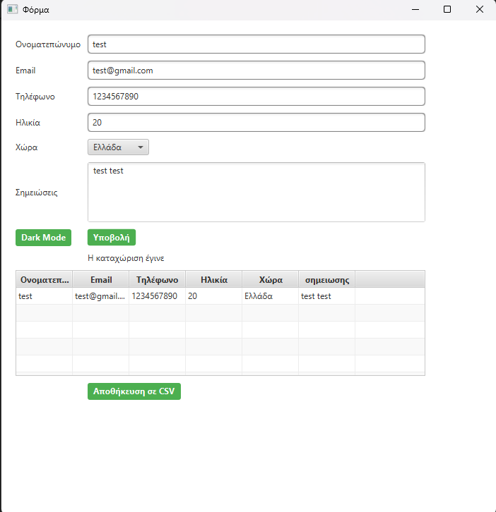
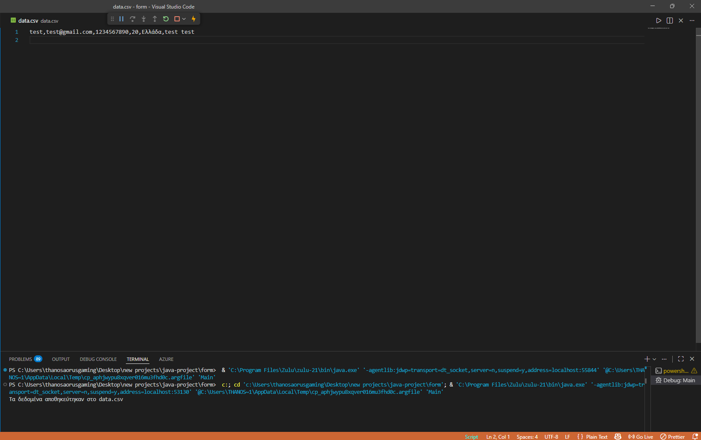

Εργασία Εξαμήνου – JavaFX - Εφαρμογή Προσωπικής Φόρμας (Personal Form Application)

Τεχνική περιγραφή

Για την δημιουργία της διεπαφής χρησιμοποιήθηκε GridPane, στο οποίο προστέθηκαν Label, TextField, ComboBox, TextArea και Button.

Ο έλεγχος των δεδομένων γίνεται με δομές if-else και regular expressions για το email και το τηλέφωνο.
Τα δεδομένα αποθηκεύονται σε ObservableList και προβάλλονται σε TableView όταν είναι πλήρως σωστά.

Για την αποθήκευση των στοιχείων χρησιμοποιείται η κλάση Person και μέθοδος savetocsv της κλάσης CSV δέχεται μια λίστα αντικειμένων Person και γράφει τα δεδομένα στο αρχείο data.csv χρησιμοποιώντας FileWriter και PrintWriter.

Η εμφάνιση της εφαρμογής υλοποιήθηκε με αρχεία CSS, ενώ υπάρχει δυνατότητα εναλλαγής Light / Dark mode με αλλαγή του stylesheet κατά την εκτέλεση.

Τεχνολογίες

Java 21

JavaFX

CSS (Light & Dark theme)

Εκτέλεση

Ανοίξτε το project στο IDE

Βεβαιωθείτε ότι το JavaFX είναι σωστά ρυθμισμένο

Εκτελέστε την κλάση Main

Σημείωση

Η εφαρμογή δημιουργήθηκε στο πλαίσιο εργασίας από ΙΕΚ και θα επεκταθεί στο μέλλον με περισσότερες λειτουργίες.

